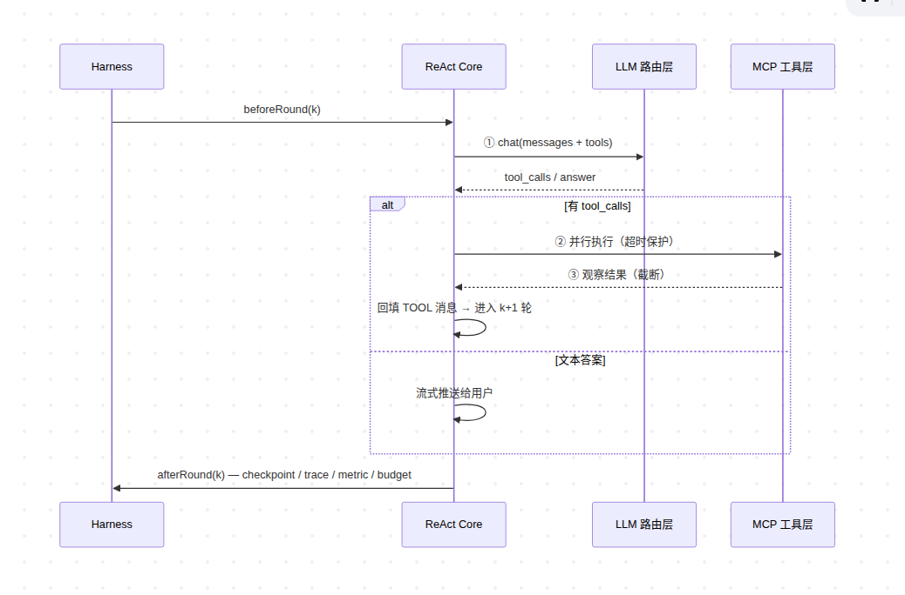

# Ragent Chunking 深度解析

> 基于源码级分析。覆盖 Parser 矩阵、Block 模型、block-aware 分块流程、双文本嵌入、与 AgentFlow 对比、六种业界策略评估、完整案例。

---

<a id="chunking-compare"></a>
## 一、Ragent vs AgentFlow 的 Chunking 对比

### 1.1 Ragent（Java）— 两层架构，结构感知优先

入口是 `StructuredChunkingService.chunk()`（`StructuredChunkingService.java:87`），三路分发：

```
blocks 非空 → block-aware 分发（MinerU/Tika 解析的强类型 Block）
blocks 为空 → legacy 文本策略（FIXED_SIZE 或 STRUCTURE_AWARE）
chunkSize=-1 → 整篇文档一个 chunk
```

**核心路径：block-aware 分发**

Parser（MinerU/Tika）先产出 6 种强类型 Block，`BlockAwareChunkerDispatcher` 逐个分发：

| Block 类型 | Chunker | 策略 |
|:---|:---|:---|
| HeadingBlock | HeadingHandler | 不产 chunk，累积 outlinePath（如 `["第3章", "3.2 销售分析"]`）注入后续 chunk |
| ParagraphBlock | ParagraphChunker | 按 token 切分，不跨 heading 边界 |
| **TableBlock** | **TableChunker** | **双文本设计**：`content`=markdown 表格给 LLM 看，`embeddingText`=key-value（`姓名:张三;年龄:25`）给 Embedding 用；每个 chunk 带完整表头；`sectionContext` 写 sheet 名+表头摘要 |
| ImageBlock | ImageChunker | 原子块，渲染 `` |
| CodeBlock | CodeChunker | 原子块（代码切碎危害大） |
| ListBlock | ListChunker | 短列表 atomic，长列表按项分组 |

分发后 **ChunkPacker** 做贪心合并：PARAGRAPH/LIST/IMAGE 相邻小块拼到接近 maxChars 预算，TABLE/CODE 保持原子；断块处用块级重叠衔接上下文。

**降级路径：legacy 文本策略**
- **FIXED_SIZE**：按字符滑动窗口 + overlap，边界对齐到换行→中文标点→英文句末（仅后跟空白才认，防切碎 URL）
- **STRUCTURE_AWARE**：Markdown 友好，扫描 Heading/CodeFence/Atomic/Paragraph 块，在块边界切分，min/target/max 预算控制

**VectorChunk 元数据**：`outlinePath`、`blockType`、`sectionContext`、`sourceBlockIds`、`assets`、`embeddingText`（独立于 content）

### 1.2 AgentFlow/PowerAgent（Python）— 扩展名路由，分类治理

入口是 `rag_flow.py` → `chunk_splitting()`，按文件扩展名自动调度（`RAG 文档处理与 OCR 面试 Q&A 0728.md:736`）：

```
扫描件(pdf/png/jpg) → OcrChunker
  ├── BlockMerge：跨页表格合并 + 页眉页脚过滤
  ├── TXTSplitter：按段落切（512 token, 50 overlap）
  └── Tabular 子管线

纯文本/Markdown
  ├── 有结构 → SeparatorRecursiveSplitter（递归分隔符：空行→换行→句号→分号→逗号）
  ├── 固定分隔符 → SeparatorSplitter
  └── 兜底 → GeneralSplitter（TokenTextSplitter, chunk_size=1024, overlap=200）

表格 → TabularRowSplitter / TabularMultiLevelHeaderSplitter
Excel → TableChunk（逐 cell）
视频 → VideoASRSplitter（ASR 时间窗口）
医保 → IntelliMedicalInsuranceSplitter（章节层级）
```

AgentFlow 的分块策略覆盖了从纯文本到 OCR 扫描件、从表格到视频的各种场景，是"分类治理"思路。

### 1.3 关键差异总结

| 维度 | Ragent | AgentFlow |
|:---|:---|:---|
| **表格处理** | **双文本**（markdown 展示 + key-value 嵌入），这是最大亮点 | 逐行拆分+层级标题保留，无双文本 |
| **解析器** | MinerU/Tika → 强类型 Block 体系 | LlamaIndex → 灵活但弱类型 |
| **Chunk 元数据** | 6 个富字段（outlinePath/blockType/sectionContext 等） | 靠 ES 索引字段 + association_info |
| **分块后处理** | ChunkPacker 贪心合并 + MetadataEnrichment 回表补齐 | ChunkMerge 多路融合 + ReRank |
| **默认大小** | block-aware 可配，FIXED_SIZE=512，STRUCTURE_AWARE target=1400 | GeneralSplitter=1024，TXTSplitter=512，表格=5000 |
| **父子文档** | 一套 chunk + MetadataEnrichment 回表还原顺序（等价父文档） | 无显式机制，靠 ChatContextFilter+quoteQA 弥补 |
| **分块调度** | 按 Block 类型路由 | 按文件扩展名路由 |

> Ragent 的 chunking 强在"结构感知深度"——表格的双文本嵌入、outlinePath 注入、ChunkPacker 合并都是精心设计的；AgentFlow 的 chunking 强在"覆盖面广度"——从 OCR 到视频到医保，场景覆盖更全，但每个策略的深度不如 Ragent。

---

<a id="parser-matrix"></a>
## 二、Parser 矩阵：6 个解析器 × 支持的具体格式

### 2.1 ParserType 枚举

```java
// ParserType.java — 6 个解析器类型
TIKA("Tika")           // Apache Tika，处理纯文本
MARKDOWN("Markdown")    // commonmark-java，处理 Markdown
EXCEL_POI("ExcelPoi")   // Apache POI，处理 Excel
CSV("Csv")              // RFC4180 解析，处理 CSV
MINERU("MinerU")        // MinerU SaaS API，处理 PDF/Word/PPT
IMAGE("Image")          // VLM 图生文，处理 PNG/JPG/SVG
```

### 2.2 路由机制与优先级

`DocumentParserSelector.selectByMimeType()` 按 Spring `@Order` 排序，返回第一个支持该 MIME 的解析器：

| Parser | @Order | 支持的 MIME 类型 | 输出 Block |
|:---|:---|:---|:---|
| **MinerU** | HIGHEST | `application/pdf`, `*wordprocessingml*`, `*msword*`, `*presentationml*`, `*powerpoint*`（**不含 Excel，Excel 默认走 POI**） | 全部 6 种 |
| **ExcelPoi** | +10 | `*spreadsheet*`, `*ms-excel*`, `*excel*` | TableBlock |
| **Csv** | +15 | `text/csv`, `application/csv`, `text/comma-separated-values` | TableBlock |
| **Markdown** | +20 | `text/markdown`, `text/x-markdown`, `text/plain` | 除 ImageBlock 外 5 种 |
| **Image** | +30 | `image/png`, `image/jpg`, `image/jpeg`, `image/svg+xml` | ImageBlock |
| **Tika** | LOWEST | **仅** `text/*`, `application/json`, `application/xml`, `application/xhtml+xml`, `application/rtf`（v1.1 已收紧，不再处理 PDF/Word） | 仅 ParagraphBlock |

Tika v1.1 收紧的关键变化：

```java
// TikaDocumentParser.supports() — 明确排除了 PDF/Word/Excel/Markdown/CSV
if (lower.startsWith("text/markdown")) return false;   // 交给 Markdown
if (lower.equals("text/csv")) return false;             // 交给 Csv
// 仅接受 text/* 与 application/json|xml 等纯文本类型
// PDF/Word/PPT 已由 MinerU 接管
```

### 2.3 每种 Block 的生产者矩阵

```
                    HeadingBlock  ParagraphBlock  TableBlock  ImageBlock  CodeBlock  ListBlock
MinerUDocumentParser     ✅            ✅             ✅          ✅          ✅         ✅
MarkdownDocumentParser   ✅            ✅             ✅          ✗          ✅         ✅
TikaDocumentParser       ✗            ✅             ✗          ✗          ✗         ✗
ExcelDocumentParser      ✗            ✗              ✅          ✗          ✗         ✗
CsvDocumentParser        ✗            ✗              ✅          ✗          ✗         ✗
ImageDocumentParser      ✗            ✗              ✗           ✅          ✗         ✗
```

**MinerU 是唯一覆盖全部 6 种 Block 的解析器，但注意：MinerU 不直接输出 Block。**

<a id="mineru-six-step"></a>
### 2.4 MinerU 的六步异步解析流程

`MinerUDocumentParser.parseStructured()` 的实际执行链路（`MinerUDocumentParser.java:126`）：

```
1. Redisson 分布式信号量获取许可（限制跨实例并发解析数）
2. MinerUClient.requestUpload() — 申请上传链接，拿 batchId + 上传 URL
3. MinerUClient.uploadFile() — 把源文件字节 PUT 到 MinerU OSS
4. MinerUPollingExecutor.submitAndAwait() — 阻塞轮询等待解析完成
5. MinerUClient.downloadZip() — 下载结果 zip
6. MinerUResultUnpacker.unpack() — 解包为 Block 列表（图片自动上传 RustFS）
```

**关键参数**（`BatchSubmitRequest`）：`ocr`、`enableTable`、`enableFormula`、`language`。

<a id="mineru-two-layer"></a>
### 2.5 MinerU 不是直接输出 Block——两层分工架构

MinerU API 返回的是一个 **zip 文件**，里面只有 `{markdown内容, 图片文件}`。Ragent 拿到后的处理链：

```
MinerU zip → 解包得到 {markdown内容, 图片文件}
  → 上传图片到 RustFS，拿公开 URL
  → MinerUResultUnpacker 把 markdown 喂给 commonmark-java 解析 AST
  → UnpackVisitor 遍历 AST，产生 Block 列表
```

真正的两层分工：

```
┌─────────────────────────────────────────────────┐
│  第一层：文档 → 可解析的中间格式                  │
│                                                 │
│  MinerU    PDF/Word/PPT  → 高质量 markdown        │
│  Tika      纯文本       → 平文本                  │
│  POI       Excel       → NormalizedTable(DTO)    │
│  commonmark .md         → AST (直接)             │
│  VLM       图片        → 中文描述 + OCR           │
│  CSV       逗号分隔     → RFC4180 解析            │
└──────────────────────┬──────────────────────────┘
                       │
                       ▼
┌─────────────────────────────────────────────────┐
│  第二层：可解析格式 → 统一 Block IR               │
│                                                 │
│  commonmark AST  → Heading/Paragraph/Table/      │
│  (MinerU路径+        Code/List/Image Block        │
│   Markdown路径                                    │
│   共用同一套代码)                                  │
│                                                 │
│  POI NormalizedTable → TableBlock                │
│  CSV RFC4180 解析     → TableBlock                │
│  VLM 图生文          → ImageBlock                 │
│  Tika 平文本          → ParagraphBlock (only)     │
└─────────────────────────────────────────────────┘
```

**MinerU 解决的是"PDF/Word/PPT 这种二进制格式 → 结构化 markdown"的问题，markdown → 6 种 Block 是 Ragent 自己的代码。没有 MinerU，Ragent 也能从 Markdown 文件产出 6 种 Block（通过 MarkdownDocumentParser）；但没有 MinerU，PDF/Word/PPT 就只能走 Tika 降级为 ParagraphBlock 平文本，丢失全部结构信息。**

<a id="commonmark-ast"></a>
### 2.6 commonmark-java AST 解析器

`commonmark-java` 是一个开源 Markdown 解析器。Ragent 用它做第二层转换：markdown 字符串 → AST 树 → Block 列表。

```java
// 两个解析器共用同一配置
private static final Parser PARSER = Parser.builder()
        .extensions(List.of(TablesExtension.create()))  // 开 GFM 表格扩展
        .build();
```

输入 Markdown → AST → Block 的映射：

```
# 标题           → Heading(level=1)    → HeadingBlock
普通段落         → Paragraph           → ParagraphBlock
| 列1 | 列2 |    → GFM TableBlock      → TableBlock (headers + rows)
- 项目列表       → BulletList          → ListBlock
1. 有序列表      → OrderedList         → ListBlock(ordered=true)
```java          → FencedCodeBlock     → CodeBlock
     → Image               → ImageBlock
```

遍历过程（`MarkdownDocumentParser.BlockExtractingVisitor`，行 133-281）：

```java
public void visit(Heading heading) {
    blocks.add(new HeadingBlock(..., heading.getLevel(), extractInlineText(heading)));
}
public void visit(Paragraph paragraph) {
    blocks.add(new ParagraphBlock(..., extractInlineText(paragraph)));
}
public void visit(CustomBlock customBlock) {
    if (customBlock instanceof TableBlock tableBlock) {
        handleTable(tableBlock);  // 提取 headers + rows → TableBlock
    }
}
```

**MinerU 路径和 Markdown 路径共用同一套 commonmark AST → Block 的代码**（`MinerUResultUnpacker.UnpackVisitor` 和 `MarkdownDocumentParser.BlockExtractingVisitor`），差异仅在于：
- MinerU 路径多了"段首 Image 提升为独立 ImageBlock + RustFS URL 替换"
- MinerU 路径有 `visit(HtmlBlock)` 处理 HTML 表格
- Markdown 路径的 `ImageBlock` 无 RustFS AssetRef

### 2.7 各 Parser 的 Block 生产细节

**TikaDocumentParser**（`TikaDocumentParser.java:68`）：
```java
// 只按 \n\n+ 空行分段，输出 ParagraphBlock 列表
// 复杂版面文档(PDF/Word/PPT)应路由到 MinerU，不走 Tika
for (String segment : text.split("\\n{2,}")) {
    blocks.add(new ParagraphBlock(UUID..., prov, List.of(), segment.strip()));
}
```

**ExcelDocumentParser**（`ExcelDocumentParser.java:44`）：用 `ExcelTableNormalizer` 处理合并单元格展开填充、多行表头展平拼接（如 `"财务|收入"`）、超链接 cell 内联为 `[text](url)`、公式 cell 求值+回退缓存值。每个 Sheet 产出一个 `TableBlock`。

**CsvDocumentParser**（`CsvDocumentParser.java:39`）：Tika `AutoDetectReader` 自动探测字符集（UTF-8/GBK/UTF-16）+ 剥离 BOM；RFC4180 解析，支持引号包裹字段、字段内逗号/换行、`""` 转义；首行为表头，其余为数据行，产出单个 `TableBlock`。

**ImageDocumentParser**（`ImageDocumentParser.java:46`）：SVG 先用 Batik 渲染成 PNG；然后用 VLM 把图片转成"中文描述 + 图中文字 OCR"作为 `description`，同时原图上传 asset-bucket 供答复展示。产出单个 `ImageBlock`，`description` 进 embedding 负责召回。

---

<a id="block-model"></a>
## 三、Block 模型详解

### 3.1 公共基类：sealed interface Block

```java
// Block.java — 编译期穷举所有子类型
@JsonTypeInfo(use = JsonTypeInfo.Id.NAME, property = "@type")
@JsonSubTypes({
    @JsonSubTypes.Type(value = HeadingBlock.class, name = "heading"),
    @JsonSubTypes.Type(value = ParagraphBlock.class, name = "paragraph"),
    @JsonSubTypes.Type(value = TableBlock.class, name = "table"),
    @JsonSubTypes.Type(value = ImageBlock.class, name = "image"),
    @JsonSubTypes.Type(value = CodeBlock.class, name = "code"),
    @JsonSubTypes.Type(value = ListBlock.class, name = "list")
})
public sealed interface Block permits HeadingBlock, ParagraphBlock, TableBlock,
                                      ImageBlock, CodeBlock, ListBlock {
    String id();                    // UUID，唯一标识
    Provenance provenance();        // 来源：文件 + sheet 名
    List<String> outlinePath();     // 章节层级路径，解析阶段为空
}
```

**设计意图**：
- `sealed interface` 保证编译期穷举，新增 Block 类型时所有 switch 必须显式处理
- 每个子类强类型字段，告别 `Map<String,Object>` 垃圾桶
- `id()` 提供唯一标识，供 `AssetRef.sourceBlockId` 与资产 key 规则引用
- markdown 不在 Block 上，chunker 渲染时按需生成——**Block 是 IR 不是终态**

### 3.2 Provenance（溯源信息）

```java
public record Provenance(String sourceFile, String sheetName) {
    public static Provenance ofFile(String sourceFile) {
        return new Provenance(sourceFile, null);
    }
    public static Provenance ofExcelCell(String sourceFile, String sheetName) {
        return new Provenance(sourceFile, sheetName);
    }
}
```

### 3.3 六种 Block 详细结构

```
Block (sealed interface)
├── id: String              — UUID，唯一标识
├── provenance: Provenance  — sourceFile + sheetName(Excel专用)
├── outlinePath: List<String> — 解析阶段为空，ChunkerNode 阶段 HeadingHandler 注入
│
├── HeadingBlock
│   ├── level: int          — 1-6（对应 # ~ ######）
│   └── text: String        — 标题文本
│
├── ParagraphBlock
│   └── text: String        — 段落文本
│
├── TableBlock
│   ├── headers: List<String> — 列名（多行表头已展平，分隔符拼接如 "财务|收入"）
│   ├── rows: List<List<String>> — 数据行（合并单元格已展开填充）
│   └── captionText: String — 表格标题（可空）
│
├── ImageBlock
│   ├── asset: AssetRef     — RustFS 上的图片 URL + MIME + sourceBlockId
│   ├── caption: String     — 图片标题（如 "图3-1:系统架构图"）
│   ├── altText: String     — 无障碍替代文本
│   └── description: String — VLM 图生文：自包含知识文本（说明图是什么 + 完整OCR）
│                             MinerU/Tika 不产此字段为 null
│
├── CodeBlock
│   ├── language: String    — 编程语言（如 "java"、"bash"），可空
│   └── code: String        — 代码内容
│
└── ListBlock
    ├── ordered: boolean    — 有序/无序
    └── items: List<String> — 列表项内容
```

JSON 序列化示例：

```json
{
  "@type": "table",
  "id": "a1b2c3d4-...",
  "provenance": {"sourceFile": "员工手册.md", "sheetName": null},
  "outlinePath": [],
  "headers": ["级别", "基本工资", "绩效系数"],
  "rows": [["P6", "15000", "1.2"], ["P7", "22000", "1.5"]],
  "captionText": null
}
```

### 3.4 ParsedDocument 和 ParseResult

```java
// 解析器统一输出：有序 Block 列表 + 文档级元数据
public record ParsedDocument(List<Block> blocks, Map<String, Object> metadata) {}

// 老的平文本解析结果（向后兼容）
public record ParseResult(String text, Map<String, Object> metadata) {}
```

---

## 四、Block-Aware 分块流程详解

### 4.1 StructuredChunkingService 入口

```java
// StructuredChunkingService.java:87
public List<VectorChunk> chunk(List<Block> blocks, String fallbackText,
                               ChunkingMode mode, ChunkingOptions options,
                               Integer rowsPerChunk) {
    // 不分块（chunkSize=-1）：整篇合成单个 chunk
    if (isWholeDocument(options)) {
        return wholeDocumentChunk(blocks, fallbackText);
    }
    // blocks 非空 → block-aware 分发
    if (blocks != null && !blocks.isEmpty()) {
        return blockAwareChunkerDispatcher.dispatch(blocks, toBlockChunkConfig(options, rowsPerChunk));
    }
    // blocks 为空 → legacy 文本策略
    if (!StringUtils.hasText(fallbackText)) return List.of();
    return chunkingStrategyFactory.requireStrategy(mode).chunk(fallbackText, options);
}
```

三路判断的优先级：不分块哨兵 > block-aware > legacy 文本策略。

<a id="chunker-dispatcher"></a>
### 4.2 BlockAwareChunkerDispatcher 分发机制

`BlockAwareChunkerDispatcher.dispatch()`（`BlockAwareChunkerDispatcher.java:62`）：

```java
for (Block b : blocks) {
    if (b instanceof HeadingBlock h) {
        outlinePath = headingHandler.update(outlinePath, h);  // 不产 chunk
        continue;
    }
    ChunkContext ctx = ChunkContext.of(outlinePath, config, chunkIndex);
    List<VectorChunk> chunks = chunkOne(b, ctx);
    result.addAll(chunks);
    chunkIndex += chunks.size();
}
// 后处理：贪心打包
return chunkPacker.pack(result, config.maxChars(), config.overlapChars());
```

`chunkOne()` 的 instanceof 分发链：

```java
private List<VectorChunk> chunkOne(Block b, ChunkContext ctx) {
    if (b instanceof ParagraphBlock p) return paragraphChunker.chunk(p, ctx);
    if (b instanceof TableBlock t)     return tableChunker.chunk(t, ctx);
    if (b instanceof ImageBlock i)     return imageChunker.chunk(i, ctx);
    if (b instanceof CodeBlock c)      return codeChunker.chunk(c, ctx);
    if (b instanceof ListBlock l)      return listChunker.chunk(l, ctx);
    throw new IllegalStateException("Unsupported Block type");
}
```

<a id="heading-handler"></a>
### 4.3 HeadingHandler — 不产 chunk，只累积路径

HeadingHandler 维护一个按标题级别更新的路径列表：

```
输入: # 员工手册                 → outlinePath = ["员工手册"]
输入: ## 第一章 入职流程         → outlinePath = ["员工手册", "第一章 入职流程"]
输入: ### 1.1 准备材料           → outlinePath = ["员工手册", "第一章 入职流程", "1.1 准备材料"]
输入: ## 第二章 考勤制度         → outlinePath = ["员工手册", "第二章 考勤制度"]
```

**不产 chunk 的设计理由**：标题是结构信息，不是可检索的知识。把标题文本作为单独 chunk 入向量库毫无意义——没有人会搜"第一章 入职流程"。正确的是把标题注入后续 chunk 的 `outlinePath`，让 LLM 看到命中 chunk 时知道它属于哪个章节。

<a id="table-chunker"></a>
### 4.4 TableChunker：双文本嵌入（Ragent 最大亮点）

`TableChunker.java:42-86`。每个 chunk 包含三种文本：

```java
// content：markdown 表格 → 给 LLM 展示
content = """
| 级别 | 基本工资 | 绩效系数 |
|---|---|---|
| P6 | 15000 | 1.2 |
| P7 | 22000 | 1.5 |"""

// embeddingText：key-value 格式 → 给 Embedding 向量化
embeddingText = """
headers=级别, 基本工资, 绩效系数
级别: P6; 基本工资: 15000; 绩效系数: 1.2
级别: P7; 基本工资: 22000; 绩效系数: 1.5"""

// sectionContext：表身份，随每块嵌入 = contextual chunking
sectionContext = "headers=级别, 基本工资, 绩效系数"
```

**为什么需要双文本**：markdown 表格的列名↔值靠位置对齐，embedding 模型读不懂位置。对比：

```
"| P6 | 15000 | 1.2 |"                       ← embedding 看到一坨乱码
"级别: P6; 基本工资: 15000; 绩效系数: 1.2"     ← embedding 看到清晰的属性-值关系
```

key-value 把语义关系写进字面，sparse/dense 检索均更优（参考 RAGFlow、STC 的做法）。

**切分规则**：
- 按 key-value 行渲染长度累加到 maxChars 预算
- `rowsPerChunk` 仅作硬上限（默认 50）
- 单行体量超预算时保持整行原子，自成一块
- 每个 chunk 都包含完整表头（数据行切到哪个 chunk，表头就跟到哪个 chunk）

<a id="code-chunker"></a>
### 4.5 CodeChunker — 原子保护

```java
// CodeChunker: 代码切碎危害大，永不切分
// 一个 FencedCodeBlock 或 IndentedCodeBlock → 一个 VectorChunk
```

### 4.6 ListChunker — 自适应

```
短列表（items < maxListItems=15） → atomic，整个列表一个 chunk
长列表（items >= 15）            → 按 itemsPerChunk=10 分组
```

### 4.7 ImageChunker — 原子保护 + 可选图生文

```java
// 渲染为 
// embeddingText 优先用 description（VLM 图生文），无 description 则用 content
// 原子块：切碎 markdown 图片链接会导致前端渲染失败
```

<a id="chunk-packer"></a>
### 4.8 ChunkPacker — 贪心合并与块级重叠

`ChunkPacker.java:40-243`。各 chunker 只负责"单个 block 内"的切分，天然是"只拆不并"。

**合并规则**：

```
MERGEABLE_TYPES = {"PARAGRAPH", "LIST", "IMAGE"}  // 可流动块
TABLE / CODE → 原子块，不参与合并，且断开合并链

贪心策略：
  buffer 累加相邻的可合并块，直到加入下一块会超 maxChars
  → flush 缓冲区（合并为一个 chunk）
  → 从缓冲区尾部取完整块作为下一轮的重叠前缀
```

**块级重叠**（非字符级）：

```java
// overlapTail: 取缓冲区尾部若干完整块，累计不超过 overlapChars 预算
// 保证跨块上下文连续，但不切碎段落/列表项/标题
private static List<VectorChunk> overlapTail(List<VectorChunk> buffer, int budget) {
    // 从后往前累加完整的 MERGEABLE 块
}
```

**合并时元数据合并**（`merge()` 方法）：
- `content` 按 `\n\n` 拼接
- `embeddingText` 逐块拼接（保留图片的描述文本）
- `outlinePath` 取最长公共前缀（跨了多个 heading 的块回退到共同上级）
- `blockType` 同质保留，异质归为 `PARAGRAPH`
- `sourceBlockIds` 去重并集
- `sectionContext` 取首个非空值

---

## 五、Legacy 文本策略（blocks 为空时的降级路径）

<a id="fixed-size"></a>
### 5.1 FIXED_SIZE — FixedSizeTextChunker

`FixedSizeTextChunker.java:43-324`。不是简单的按字符数切——做了三层优化：

**① normalizeText() 预处理**：

```
修复 URL 被换行拆开:    dingtalk.\ncom  →  dingtalk.com
修复中文词中间软换行:    商\n保通       →  商保通
保护列表项不被误吞:      \n2. xxx       →  不合并（检测数字+./））
保护空行段落边界:        ≥2 连续换行    →  不合并（段落分隔符）
```

**② adjustToBoundary() 边界对齐**（向前 lookup 不超过 overlap）：

```
1. 换行符 \n           → 优先在段落边界切
2. 中文标点 。！？      → 次优在句末切
3. 英文标点 .!?（仅后跟空白才认）→ 避免切碎 URL 域名
```

**③ 强制推进防止死循环**：如果 `end <= lastEnd`（回退过头），直接跳到 `targetEnd`。

### 5.2 STRUCTURE_AWARE — StructureAwareTextChunker

`StructureAwareTextChunker.java:44-327`。Markdown 友好的结构感知降级方案。

**三步流程**：

```
1. segmentToBlocks(text) — 线性扫描，识别 4 种逻辑块：
   HEADING  → /^#{1,6}\s+.*$/   → 独立块（自动成为边界）
   CODE     → 围栏 ``` 隔离      → 独立块
   ATOMIC   → 图片/链接行        → 独立块（切碎渲染就崩）
   PARA     → 空行分隔的段落     → 多行合并

2. packBlocksToChunks(blocks, min, target, max) — 仅在块边界切分：
   贪心累加块直到接近 target，不超过 max
   若当前 chunk 不足 min 且下一块能加则"忍一次超限"

3. materialize(text, ranges, overlap) — 物化为 VectorChunk
   可选的 overlap：复制上一 chunk 尾部子串到下一 chunk 开头
```

**与递归字符切分的本质差异**：递归字符的问题是"能找到分隔符但不知道分隔符的意义"。`\n\n` 可能是段落边界也可能是表格内的空行。STRUCTURE_AWARE 先分类再分块，避免了这个问题。

<a id="structure-aware-vs-blockaware"></a>
### 5.2.1 STRUCTURE_AWARE vs Block-Aware：同一思路，不同精度

**两者的核心逻辑完全一致**——"先识别结构，只在结构边界切分"。区别在于识别结构的手段和精度：

```
STRUCTURE_AWARE（regex 行扫描）          Block-Aware（commonmark AST）
─────────────────────────────────────  ───────────────────────────────
/^#{1,6}\s+.*$/  → HEADING            Heading 节点      → HeadingBlock
空行分隔          → PARA                Paragraph 节点    → ParagraphBlock
/^```.*$/        → CODE                FencedCodeBlock   → CodeBlock
/^!\[.../        → ATOMIC              Image 节点        → ImageBlock
                                       BulletList 节点   → ListBlock
                                       GFM TableBlock    → TableBlock
```

**STRUCTURE_AWARE 覆盖不到的东西**（为什么它是降级路径而非主力策略）：

1. **没有 ListBlock** — 列表项被当成普通段落（PARA），和周围的文本段落混在一起。无法区分有序/无序，也无法在检索时按列表类型分流
2. **没有 TableBlock** — markdown 表格被当成普通段落，双文本嵌入（key-value）无从谈起，embedding 模型面对 markdown 表格行只能看到被竖线分隔的 token
3. **没有 ImageBlock** — 图片行只是标记为 ATOMIC 防止切碎，但没有 RustFS AssetRef 和 VLM description。检索时图片没有独立的资产引用，也无法被 VLM 描述文本召回
4. **没有 outlinePath 注入** — HEADING 只用来做 chunk 边界（遇到标题就断块），不会像 HeadingHandler 那样累积路径并注入到后续块的元数据。chunk 不知道自己属于哪个章节
5. **没有 sectionContext** — 表格的表头摘要、sheet 名等上下文信息完全丢失
6. **没有嵌套结构处理** — 代码块内的 markdown 语法、列表嵌套、引用块内嵌表格等，regex 无法正确解析。AST 方案天然支持递归嵌套

**一句话**：STRUCTURE_AWARE 是 block-aware 的降级近似，它用 regex 做到了"在结构边界切分"这个最低要求，但没有强类型 Block 体系带来的精细处理能力。当文档经过 Parser 拿到强类型 Block 时走 block-aware 获得完整能力，当只有纯文本（Tika 产出的平文本、用户粘贴的文本）时走 STRUCTURE_AWARE 至少保证不在句子中间乱切。

### 5.3 ChunkingMode 枚举与配置

```java
public enum ChunkingMode {
    FIXED_SIZE("fixed_size")        // chunkSize=512, overlapSize=128
    STRUCTURE_AWARE("structure_aware") // targetChars=1400, maxChars=1800, minChars=600, overlapChars=0
}
```

配置通过 `sealed interface ChunkingOptions` 传递（策略模式），两个子类：
- `FixedSizeOptions(chunkSize, overlapSize)`
- `TextBoundaryOptions(targetChars, overlapChars, maxChars, minChars)`

---

<a id="vector-chunk-metadata"></a>
## 六、VectorChunk 元数据字段

`VectorChunk.java:43-118`。比 LangChain Document 的 metadata 更结构化：

| 字段 | 类型 | 用途 |
|:---|:---|:---|
| `chunkId` | String | Snowflake 雪花 ID |
| `index` | Integer | 文档内序号，从 0 递增 |
| `content` | String | 展示 + 回填 LLM 上下文（表格为 markdown） |
| `embeddingText` | String | 嵌入专用，表格用 key-value；`@JsonIgnore` 不持久化 |
| `blockType` | String | PARAGRAPH / TABLE / IMAGE / CODE / LIST / HEADING |
| `outlinePath` | List\<String\> | 章节路径，如 `["第3章", "3.2 销售分析"]` |
| `sectionContext` | String | 表格 sheet 名 + 表头摘要，检索时拼入 LLM 上下文 |
| `sourceBlockIds` | List\<String\> | 来源 Block.id，精确溯源 |
| `assets` | List\<AssetRef\> | 图片引用（URL + MIME + sourceBlockId），检索时注入 |
| `metadata` | Map\<String,Object\> | 扩展元数据 |
| `embedding` | float[] | 向量嵌入，`@JsonIgnore` 不序列化 |

---

<a id="full-example"></a>
## 七、完整案例：一份 Markdown 文件从解析到入库

输入 `员工手册.md`：

```markdown
# 员工手册

## 第一章 入职流程

新员工入职需要完成以下步骤。

### 1.1 准备材料

请准备以下材料：

- 身份证原件及复印件
- 学历证书复印件
- 一寸照片 2 张

### 1.2 薪资结构

| 级别 | 基本工资 | 绩效系数 |
|------|---------|---------|
| P6   | 15000   | 1.2     |
| P7   | 22000   | 1.5     |
| P8   | 32000   | 2.0     |

新人第一年按80%发放。

## 第二章 考勤制度

考勤规则如下：

1. 工作日 9:00-18:00
2. 迟到 30 分钟内不扣薪
3. 每月 3 次免打卡机会
```

### 阶段 1：MarkdownDocumentParser → ParsedDocument

commonmark-java 解析 AST，`BlockExtractingVisitor` 遍历产出 12 个 Block。

每个 Block 都携带 3 个公共字段：`id`（UUID）、`provenance`（`{"sourceFile":"员工手册.md","sheetName":null}`）、`outlinePath`（解析阶段为 `[]`，ChunkerNode 阶段由 HeadingHandler 注入）。以下展示各 Block 的类型专属字段：

```json
{
  "blocks": [
    {"@type":"heading",  "id":"uuid-01", "provenance":{"sourceFile":"员工手册.md","sheetName":null}, "outlinePath":[], "level":1, "text":"员工手册"},
    {"@type":"heading",  "id":"uuid-02", "provenance":{"sourceFile":"员工手册.md","sheetName":null}, "outlinePath":[], "level":2, "text":"第一章 入职流程"},
    {"@type":"paragraph","id":"uuid-03", "provenance":{"sourceFile":"员工手册.md","sheetName":null}, "outlinePath":[], "text":"新员工入职需要完成以下步骤。"},
    {"@type":"heading",  "id":"uuid-04", "provenance":{"sourceFile":"员工手册.md","sheetName":null}, "outlinePath":[], "level":3, "text":"1.1 准备材料"},
    {"@type":"paragraph","id":"uuid-05", "provenance":{"sourceFile":"员工手册.md","sheetName":null}, "outlinePath":[], "text":"请准备以下材料："},
    {"@type":"list",     "id":"uuid-06", "provenance":{"sourceFile":"员工手册.md","sheetName":null}, "outlinePath":[], "ordered":false, "items":["身份证原件及复印件","学历证书复印件","一寸照片 2 张"]},
    {"@type":"heading",  "id":"uuid-07", "provenance":{"sourceFile":"员工手册.md","sheetName":null}, "outlinePath":[], "level":3, "text":"1.2 薪资结构"},
    {"@type":"table",    "id":"uuid-08", "provenance":{"sourceFile":"员工手册.md","sheetName":null}, "outlinePath":[], "headers":["级别","基本工资","绩效系数"], "rows":[["P6","15000","1.2"],["P7","22000","1.5"],["P8","32000","2.0"]]},
    {"@type":"paragraph","id":"uuid-09", "provenance":{"sourceFile":"员工手册.md","sheetName":null}, "outlinePath":[], "text":"新人第一年按80%发放。"},
    {"@type":"heading",  "id":"uuid-10", "provenance":{"sourceFile":"员工手册.md","sheetName":null}, "outlinePath":[], "level":2, "text":"第二章 考勤制度"},
    {"@type":"paragraph","id":"uuid-11", "provenance":{"sourceFile":"员工手册.md","sheetName":null}, "outlinePath":[], "text":"考勤规则如下："},
    {"@type":"list",     "id":"uuid-12", "provenance":{"sourceFile":"员工手册.md","sheetName":null}, "outlinePath":[], "ordered":true, "items":["工作日 9:00-18:00","迟到 30 分钟内不扣薪","每月 3 次免打卡机会"]}
  ],
  "metadata": {"parser":"Markdown","mimeType":"text/markdown","blocks":12}
}
```

> **注意 `outlinePath` 在解析阶段全是空列表**。因为 Parser 不知道文档结构——它只是逐个解析 Block，不做跨 Block 的层级追踪。`outlinePath` 的注入时机在下一阶段：ChunkerNode 遍历 Block 列表时由 HeadingHandler 累积后注入到每个 chunk 的元数据中。

### 阶段 2：StructuredChunkingService → BlockAwareChunkerDispatcher 分发

```
Block[0] HeadingBlock("员工手册", level=1)
  → HeadingHandler.update → outlinePath = ["员工手册"]

Block[1] HeadingBlock("第一章 入职流程", level=2)
  → outlinePath = ["员工手册", "第一章 入职流程"]

Block[2] ParagraphBlock("新员工入职需要完成以下步骤。")
  → ParagraphChunker → VectorChunk{index=0, content="新员工入职...", outlinePath=["员工手册","第一章 入职流程"]}

Block[3] HeadingBlock("1.1 准备材料", level=3)
  → outlinePath = ["员工手册", "第一章 入职流程", "1.1 准备材料"]

Block[4] ParagraphBlock("请准备以下材料：")
  → VectorChunk{index=1, content="请准备以下材料：", outlinePath=[..., "1.1 准备材料"]}

Block[5] ListBlock(items=3)
  → ListChunker: 3 < maxListItems(15) → atomic
  → VectorChunk{index=2, content="- 身份证原件...\n- 学历证书...\n- 一寸照片...", blockType="LIST"}

Block[6] HeadingBlock("1.2 薪资结构", level=3)
  → outlinePath = ["员工手册", "第一章 入职流程", "1.2 薪资结构"]

Block[7] TableBlock(headers=["级别","基本工资","绩效系数"], rows=[3行])
  → TableChunker: 双文本
  → VectorChunk{index=3,
      content="| 级别 | 基本工资 | 绩效系数 |\n|---|---|---|\n| P6 | 15000 | 1.2 |\n| P7 | 22000 | 1.5 |\n| P8 | 32000 | 2.0 |",
      embeddingText="headers=级别, 基本工资, 绩效系数\n级别: P6; 基本工资: 15000; 绩效系数: 1.2\n...",
      blockType="TABLE", outlinePath=[..., "1.2 薪资结构"]}

Block[8] ParagraphBlock("新人第一年按80%发放。")
  → VectorChunk{index=4, content="新人第一年按80%发放。"}

Block[9] HeadingBlock("第二章 考勤制度", level=2)
  → outlinePath = ["员工手册", "第二章 考勤制度"]

Block[10] ParagraphBlock("考勤规则如下：")
  → VectorChunk{index=5, ...}

Block[11] ListBlock(ordered=true, items=3)
  → VectorChunk{index=6, content="1. 工作日 9:00-18:00\n2. 迟到 30 分钟内不扣薪\n3. 每月 3 次免打卡机会", blockType="LIST"}
```

### 阶段 3：ChunkPacker 贪心合并

```
合并前: [P0]=28字  [P1]=10字  [L2]=45字  [T3]=表格原子  [P4]=12字  [P5]=7字  [L6]=55字

假设 maxChars=512:
  buffer: [P0] 28字 → +P1=38字 → +L2=83字 → 继续
  遇到 T3(表格,非MERGEABLE) → flush([P0,P1,L2]) → 合并块1 {"员工手册", "第一章 入职流程"}
  T3 原样保留 → 合并块2
  buffer: [P4] 12字 → +P5=19字 → +L6=74字 → flush → 合并块3 {"员工手册", "第二章 考勤制度"}

合并后: 3 个 VectorChunk → ChunkEmbeddingService
```

### 阶段 4：ChunkEmbeddingService → 向量库

- T3（表格）用 `embeddingText`（key-value）调 Embedding 模型
- 其他 chunk 用 `content`（markdown）调 Embedding 模型
- 写入 Milvus/PGVector

---

<a id="parent-child"></a>
## 八、Parent-Child 等价方案（零额外成本）

```
传统 Parent-Child：
  父 chunk(大) ──→ Embedding ① ──→ 向量库
  子 chunk(小) ──→ Embedding ② ──→ 向量库
  检索命中子 chunk → 关联查询父 chunk → 喂 LLM
  成本: 2x Embedding + 2x 存储 + 1x 关联查询

Ragent 等价方案：
  只有一套 chunk(正常粒度) ──→ Embedding ──→ 向量库
  检索命中 chunk → MetadataEnrichment 回表
  → 按 docId 分组 → 按 chunkIndex 排序
  → 还原原文顺序 → 取相邻 chunk 拼入上下文
  成本: 1x Embedding + 1x 存储 + 元数据字段
```

本质是通过 **outlinePath + sectionContext + chunkIndex 排序** 三个元数据实现了"父文档"效果，不需要存储两套 chunk。Blog 说的"索引量 ×2、多一次关联查询"在 Ragent 中不存在。

AgentFlow 没有显式的父子文档机制，靠 `ChatContextFilter` 上下文截断 + `quoteQA` 组合达到类似效果。

---

<a id="industry-strategies"></a>
## 九、业界六种分块策略评估

> 这六种不是并列选项，而是三层递进——前三种是"怎么切"（算法），后三种是"按什么边界切"（结构约束）。

### 9.1 固定长度 (Fixed-size by Token)

**博客说的**：按 Token 硬切 + overlap，快速验证 RAG 可行性。风险：条件/结论被切断，语义破碎。

**实战真相**：
- Ragent 的 `FixedSizeTextChunker` 不是简单按字符数切——做了三层边界对齐（换行→中文标点→英文句末）+ normalizeText() 修复 URL/CJK 软换行
- AgentFlow 的 `GeneralSplitter` 用 LlamaIndex `TokenTextSplitter(chunk_size=1024, overlap=200)`，就是博客说的朴素版本
- **Ragent 在这个策略上比博客描述的多做了边界对齐和 URL 修复**

### 9.2 递归字符 (Recursive Character Splitter)

**博客说的**：按优先级递归找分隔符：`\n\n` → `\n` → `。` → ` ` 。通用文本适用。风险：无结构感知，章节边界无法识别。

**实战真相**：
- AgentFlow 有 `SeparatorRecursiveSplitter`（`chunk_size=1024, overlap=200`），标准 LangChain 风格
- Ragent **没有独立的递归字符切分器**。但 `StructureAwareTextChunker` 的扫描逻辑是同一思路的升级版——先扫描为 4 种逻辑块再在块边界切分，避免了"`\n\n` 可能是段落边界也可能是表格内空行"的问题

### 9.3 语义切分 (Semantic/Embedding-based splitting)

**博客说的**：计算相邻句子的 Embedding 相似度，相似度骤降处切分。默认参数下平均块仅 43 Token。

**实战真相**：Ragent 和 AgentFlow **都没有实现**。原因：
1. **成本不可接受**：每个文档要对每句话做一次 Embedding + 相似度计算
2. **43 Token 的块太碎了**：检索精度看似高但召回块缺上下文，LLM 看不懂
3. **相似度"骤降"不可靠**：主题过渡是渐进的，阈值极其敏感

### 9.4 结构感知 (Structure-aware by Headings)

**博客说的**：按标题/章节层级切分。适用于 Markdown/HTML。风险：严重依赖上游解析质量。

**这是两个项目差距最大的策略。**

**Ragent 的 block-aware 是结构感知的完全体**：
- Parser 产出 6 种强类型 Block
- HeadingHandler 累积 outlinePath 注入每个 chunk
- 每个 chunk 带 `outlinePath`（如 `["员工手册", "第一章 入职流程", "1.2 薪资结构"]`）和 `sectionContext`
- 检索时 LLM 看到的不仅是 chunk 文本，还知道它属于哪个章节

**AgentFlow 的结构感知更接近博客描述的朴素版本**：
- `SeparatorRecursiveSplitter` 知道分隔符优先级但不知道文档结构
- OCR 管线的 `TXTSplitter` 有标题树 + 小段落合并，但不产 outlinePath、不区分 block 类型

### 9.5 页面级 (Page-level)

**博客说的**：按物理页边界切。适用于金融报告/法律文档。风险：随机导出的 PDF 页边界 ≠ 语义边界。

**实战真相**：
- Ragent 的 `Provenance` 可记录页码信息，但**当前没有页面级分块策略**。这是合理的选择——页面是渲染层概念，向量检索关心的是语义层
- AgentFlow 的 OCR 管线特别做了**跨页段落合并**和**跨页表格合并**——检测末页无标点自动合并、检测上下页表格列数匹配自动合并 HTML/cells。这恰恰说明：**页面级分块需要配套的跨页检测逻辑**，不是简单的 `split by page`

### 9.6 Parent-Child (父子文档)

**博客说的**：小块检索（子 chunk 做 Embedding）+ 大块上下文（父 chunk 做 LLM 输入）。风险：索引量 ×2，多一次关联查询。

**Ragent 实现了"零成本等价方案"**（详见第八章）。

### 9.7 总结矩阵

| 策略 | Ragent | AgentFlow | 实现深度差异 |
|:---|:---|:---|:---|
| 固定长度 | FIXED_SIZE（带边界对齐+URL修复） | GeneralSplitter（朴素 TokenTextSplitter） | Ragent 多做了三层边界对齐 |
| 递归字符 | 无独立实现，STRUCTURE_AWARE 是升级版 | SeparatorRecursiveSplitter | AgentFlow 有，Ragent 跳过了这一级 |
| 语义切分 | **无** | **无** | 成本/效果比不划算，两个项目都没做 |
| 结构感知 | block-aware（6 种 Block + outlinePath + sectionContext） | OCR管线（标题树 + 段落合并） | Ragent 远深于博客描述 |
| 页面级 | Provenance 可记录页码，但不用作分块边界 | OCR 管线有跨页合并（反页面切分） | 两者都不把页面当分块边界 |
| Parent-Child | 一套 chunk + 元数据回表（零额外成本） | ChatContextFilter + quoteQA | Ragent 方案更系统化 |

---

<a id="interview-talk-points"></a>
## 十、面试话术

### "介绍一下 Ragent 的文档切分策略"

> Ragent 的分块是两层架构。第一层是 Parser 层，6 个解析器按 MIME 类型分层路由——MinerU 处理 PDF/Word/PPT、POI 处理 Excel、commonmark 处理 Markdown、VLM 处理图片、Tika 兜底纯文本。MinerU 解决的是二进制格式到结构化 markdown 的转换，并不直接输出 Block。markdown → Block 这一步是 Ragent 自己的 commonmark AST 解析器做的，MinerU 路径和 Markdown 路径共用同一套代码。
>
> 第二层是 Chunker 层。解析器产出的强类型 Block（6 种 sealed interface）通过 BlockAwareChunkerDispatcher 分发到 6 个专属 Chunker。HeadingBlock 不产 chunk，只累积 outlinePath 注入后续块。最关键的差异化设计是表格的**双文本嵌入**——content 用 markdown 表格给 LLM 展示，embeddingText 用 key-value 格式给 Embedding 向量化。因为 embedding 模型读不懂 markdown 表格的列位置对齐，key-value 把"列名: 值"的语义关系写进字面，sparse/dense 检索都更准。每个表格 chunk 还带 `sectionContext`（sheet 名+表头摘要），做到 contextual chunking。
>
> 各 chunker 只拆不并，最后 ChunkPacker 做贪心合并，TABLE/CODE 保持原子块，PARAGRAPH/LIST/IMAGE 小块拼到 maxChars 预算，断块处用完整块级重叠保持上下文连续性。
>
> 跟业界典型的 Parent-Child 方案比，我们没有存两套 chunk。通过 outlinePath + sectionContext + chunkIndex 排序回表还原原文顺序，达到了同样的"扩大上下文窗口"效果，但省去了双倍 Embedding 和存储成本。

### "你们为什么用 MinerU？它解决了什么问题？"

> MinerU 解决的是"不可直接读取的二进制格式 → 高质量 markdown"这个最难的转换问题。PDF 里面的文字顺序、表格结构、公式识别都是业界难题。MinerU 做了阅读顺序排序、表格结构还原、公式 LaTeX 转换、图片提取这些事。
>
> 但它输出的仍然是 markdown，不是我们的 Block。Ragent 拿到 MinerU 的 markdown 后，用 commonmark-java 解析成 AST，再遍历 AST 产出 6 种强类型 Block。MinerU 和 Markdown 两条路径在 AST → Block 这一步共用完全相同的一套代码。所以 MinerU 是"高质量 markdown 供应商"，不是"Block 生产者"。
>
> 没有 MinerU，PDF/Word/PPT 就只能走 Tika 降级为 ParagraphBlock 平文本，表格变平文本、标题信息丢失、图片无法提取——全部结构信息损毁。

### "和 AgentFlow/Dify/LangChain 的分块有什么不同？"

> AgentFlow 是分类治理模式——按文件扩展名路由到不同 Splitter，覆盖面广但每种策略深度有限。Ragent 是结构感知优先——Parser 产出强类型 Block、Chunker 按 Block 类型精细处理、表格做双文本嵌入。AgentFlow 的表格就是逐行 TokenTextSplitter，不会区分 embedding 用和展示用的文本。
>
> LangChain 的 RecursiveCharacterTextSplitter 能找到分隔符但不知道分隔符的意义，`\n\n` 可能是段落边界也可能是表格内空行。Ragent 先分类再分块，避免了这个问题。Dify 也是类似的分隔符优先级模式。
>
> 另外 Ragent 的 `VectorChunk` 带 6 个富元数据字段（outlinePath/blockType/sectionContext/sourceBlockIds/assets/embeddingText），这些在 LangChain 的 Document.metadata 里是完全没有结构约束的自由 JSON。

### "六种分块策略你们用了哪些？为什么有些不用？"

> 结构感知是我们的主力策略，block-aware 分发 + outlinePath 注入 + 双文本嵌入。固定长度是降级兜底，但做了三层边界对齐。递归字符我们没有独立实现，STRUCTURE_AWARE 本质上是它的升级版。
>
> 语义切分（Embedding 相似度检测）我们没做——成本太高（每句话一次 Embedding），默认参数下平均块只有 43 Token，太碎；而且相似度"骤降"的阈值极难调准。页面级我们也不做——页面是渲染层概念，语义边界和物理边界是两回事，AgentFlow 特意做了跨页合并来对抗这个问题。
>
> Parent-Child 我们做了但不存两套 chunk——用 outlinePath + sectionContext + chunkIndex 排序回表还原原文顺序，效果等同但省去双倍成本。

---

<a id="metadata-details"></a>
## 十一、元数据（Metadata）详解

> 每个 Chunk 入库时携带的元数据是投入产出比最高的一步——保留成本极低，但不保留就几乎无法事后重建。

### 11.1 Ragent Chunk 实际携带的完整元数据

**chunk 自身字段**（`VectorChunk`，`VectorChunk.java:43-118`）：

```json
{
    "chunkId":         "1887234567890123456",
    "index":           3,
    "content":         "| 级别 | 基本工资 |...",
    "blockType":       "TABLE",
    "outlinePath":     ["第三章", "3.2 分产品线销量"],
    "sectionContext":  "sheet=Sheet1; headers=级别, 基本工资, 绩效系数",
    "sourceBlockIds":  ["uuid-1", "uuid-2"],
    "assets":          [{"publicUrl":"...", "mimeType":"image/png", "sourceBlockId":"..."}],
    "metadata":        {},
    "embeddingText":   "级别: P6; 基本工资: 15000;...",
    "embedding":       [0.023, -0.015, ...]
}
```

**入库时追加的 doc 级元数据**（`MetadataEnrichment` 后处理器回表补齐）：

```json
{
    "docId":       "1887234000000000001",
    "docName":     "2026-Q2财报.pdf",
    "chunkIndex":  3
}
```

### 11.2 博客推荐的 7 个字段 vs Ragent 对照

```
博客字段               Ragent 对应                    覆盖?
─────────────────────────────────────────────────────────
source              Provenance.sourceFile            ✅ 有，但不在 chunk 上，在 doc 级
section_path        outlinePath                      ✅ 有，且是 List 非字符串，更结构化
page_number         Provenance 可记录但当前未用        ⚠️ 字段有，但解析器未填充页码
chunk_index         VectorChunk.index                ✅ 有
doc_type            无（可用 blockType 近似）          ⚠️ doc 类型在 DB 的 doc 表，不在 chunk
embedding_model     无                                ❌ 没有
created_at          chunkId(Snowflake)可反解时间       ⚠️ 有隐含时间，无显式字段
```

<a id="metadata-field-analysis"></a>
### 11.3 逐字段分析

**① section_path → outlinePath（✅ 更强）**

博客用字符串 `"第三章 > 3.2 分产品线销量"`，Ragent 用 `List<String>`：

```java
// 博客：字符串拼接，没法按级别过滤
"第三章 > 3.2 分产品线销量"

// Ragent：结构化列表，可以只取前两级做过滤
["第三章", "3.2 分产品线销量"]
// filter by outlinePath[0] == "第三章" → 限制检索范围到某一章
```

**② source → Provenance.sourceFile（✅ 有，但范式化了）**

博客建议存 chunk 上（宽表），Ragent 存在 doc 表（范式化）。`sourceFile` 只在 Parser 阶段填写，入库后被 `docName` 替代。好处：源文件改名不影响 chunk 引用。坏处：多一跳 join。

**③ page_number（⚠️ 字段有，未填充）**

`Provenance` 记录目前只有 `sourceFile` 和 `sheetName`，没有 `pageNumber`。MinerU 产出的 markdown 里其实有页码信息，但 `UnpackVisitor` 没有提取到 `Provenance` 上。这导致引用标注时能标注到"第 3.2 节"（outlinePath），但标注不到"第 18 页"。

**④ chunk_index → index（✅）**

完全对应。Ragent 用 Integer，从 0 递增，ChunkPacker 合并后重排。关键用途：检索命中 chunk 后，通过 `docId` + `chunkIndex` 拉取前后相邻块扩展上下文——Parent-Child 等价方案的核心。

**⑤ doc_type（⚠️ 不在 chunk 上）**

Ragent 的 `doc_type` 存在 `t_knowledge_document` 表里（文档级别的分类），不在每个 chunk 上存储。检索过滤时走 doc 表 join。博客建议放 chunk 上是为了避免 join，但一个文档的所有 chunk 必然同类型，存 chunk 上是冗余。

**⑥ embedding_model（❌ 没有）**

博客说"很多人漏掉"的字段，Ragent 确实漏掉了。当前切换 Embedding 模型时没有按 model 重建 index 的机制。如果要做：在 `ChunkEmbeddingService` 写入前把当前 `embeddingModel` 写入 VectorChunk 的 `metadata` Map（这个 Map 就是预留的扩展点），或单独在 `t_knowledge_vector` 表加列。

**⑦ created_at（⚠️ 隐含在 chunkId 中）**

`chunkId` 用 Snowflake 雪花 ID，前 41 位是时间戳（毫秒），可反解出创建时间。但不是显式字段，要写 SQL 函数才能直接用时间过滤。博客建议显式存 `created_at` 主要是为了"找出旧模型建的 chunk 定向重建"——和 ⑥ 是同一个需求。

<a id="metadata-chunker-fields"></a>
### 11.4 每个 chunker 注入的字段对照表

这是前面"HeadingHandler 累积路径注入到后续块的元数据"问题的完整答案——不仅 outlinePath，每个 chunker 在构建 VectorChunk 时各注入了不同字段：

```
                    Paragraph   Table      Image        Code       List
                    ─────────   ─────      ─────        ────      ────
chunkId             Snowflake   Snowflake  Snowflake    Snowflake  Snowflake
index               startIndex  startIndex startIndex   startIndex startIndex
content             text        表格md     描述+链接     ```围栏    -/1.渲染
embeddingText       ❌ 不设     ✅ kv行     ✅ 描述去URL  ❌ 不设    ❌ 不设
blockType           "PARAGRAPH" "TABLE"    "IMAGE"      "CODE"     "LIST"
outlinePath         ✅          ✅         ✅           ✅         ✅
sourceBlockIds      ✅ [b.id]   ✅ [b.id]  ✅ [b.id]    ✅ [b.id]  ✅ [b.id]
assets              ❌          ❌         ✅ [AssetRef] ❌         ❌
sectionContext      ❌          ✅ 表身份   ✅ sheet名   ❌         ❌
metadata            ❌          ❌         ❌           ❌         ❌
```

**关键观察**：

1. **outlinePath 是唯一所有 chunker 都注入的字段**——来自 ChunkContext，由 HeadingHandler 累积
2. **embeddingText 只有 TableChunker 和 ImageChunker 设置**——这两个类型的 chunk 存在"展示格式 ≠ 嵌入格式"的问题。Paragraph/Code/List 的 content 天然适合直接 embedding
3. **sectionContext 只有 TableChunker 和 ImageChunker 设置**——表格和图片切碎后需要额外的"我是谁"身份信息，段落/代码/列表的上下文由 outlinePath 充分表达
4. **assets 只有 ImageChunker 设置**——只有图片需要携带 RustFS 上的资源引用，供检索时注入 LLM 上下文
5. **所有 chunker 都设置 sourceBlockIds**——保证每个 chunk 都能追溯到 Parser 产出的具体 Block

**ChunkPacker 合并时这些字段的变化**（`ChunkPacker.merge()`）：

| 字段 | 合并策略 | 示例 |
|:---|:---|:---|
| **outlinePath** | **取最长公共前缀** | `["员工手册","第一章","1.1"]` + `["员工手册","第一章","1.2"]` → `["员工手册","第一章"]`（跨了两个子节，回退到共同上级章节） |
| **sourceBlockIds** | 去重并集 | `["b1","b2"]` + `["b2","b3"]` → `["b1","b2","b3"]` |
| **assets** | 去重并集 | 多个图片块合并时所有 AssetRef 汇总 |
| **blockType** | 同质保留，异质 → `PARAGRAPH` | PARAGRAPH+PARAGRAPH → PARAGRAPH；PARAGRAPH+IMAGE → PARAGRAPH |
| **sectionContext** | 取首个非空值 | 合并块归属第一个有 sectionContext 的 chunk |
| **embeddingText** | 逐块按 `\n\n` 拼接 | 图片描述文本拼在一起，保留 embedding 信息 |
| **content** | 逐块按 `\n\n` 拼接 | 段落间保留空行分隔 |

<a id="metadata-lifecycle"></a>
### 11.5 元数据的完整生命周期

```
Parser 阶段（6 个解析器）
  │  Block.id            — UUID
  │  Block.provenance    — sourceFile + sheetName
  │  Block.text/headers/rows/code/items — 强类型字段
  │  ImageBlock.asset    — AssetRef (RustFS URL + MIME)
  │  ImageBlock.description — VLM 图生文
  │
  ▼
HeadingHandler（不产 chunk，只维护路径状态）
  │  heading.text → outlinePath 累积
  │  算法：同级替换、上级追加、顶级重置、跳级补齐
  │
  ▼
各 Chunker + ChunkContext{outlinePath, config, startIndex}
  │  ParagraphChunker  → content, blockType="PARAGRAPH", outlinePath, sourceBlockIds
  │  TableChunker      → content(md表格), embeddingText(kv行), blockType="TABLE",
  │                       sectionContext(sheet+caption+headers), outlinePath, sourceBlockIds
  │  ImageChunker      → content(描述+), embeddingText(描述去URL),
  │                       blockType="IMAGE", assets, sectionContext(sheet), outlinePath, sourceBlockIds
  │  CodeChunker       → content(```围栏), blockType="CODE", outlinePath, sourceBlockIds
  │  ListChunker       → content(-/1.渲染), blockType="LIST", outlinePath, sourceBlockIds
  │
  ▼
ChunkPacker（合并相邻小块时元数据融合）
  │  outlinePath     → 最长公共前缀（跨子节时回退到共同上级章节）
  │  sourceBlockIds  → 去重并集
  │  assets          → 去重并集
  │  blockType       → 同质保留，异质→"PARAGRAPH"
  │  sectionContext  → 首个非空值
  │  embeddingText   → 逐块按 \n\n 拼接
  │  content         → 逐块按 \n\n 拼接
  │
  ▼
ChunkEmbeddingService
  │  embeddingText != null → 用 embeddingText 调 Embedding API
  │  embeddingText == null → 回退到 content 调 Embedding API
  │  embedding 写入 VectorChunk.embedding（@JsonIgnore，不持久化到 DB 的文本列）
  │
  ▼
向量库（Milvus/PGVector）
  │  embedding        → float[] 向量列
  │  chunkId/index/content/blockType/outlinePath/sectionContext → 元数据列
  │
  ▼
检索时 MetadataEnrichment 后处理器回表补齐
  │  docId       → t_knowledge_chunk.docId → t_knowledge_document.id
  │  docName     → t_knowledge_document.doc_name → 剥后缀 → 业务码
  │  chunkIndex  → 按 docId 分组 + chunkIndex 排序 → 还原原文顺序
```

### 11.6 "Metadata 能解锁的能力" 对照

| 能力 | 博客方案 | Ragent 实现 |
|:---|:---|:---|
| **精准过滤** | `filter(doc_type="policy", year=2026)` | ✅ 检索时通过意图节点 `filterExpression` 过滤 docType/kbId |
| **上下文扩展** | `chunk_index` 拉取前后相邻块 | ✅ MetadataEnrichment: 按 docId 分组 → chunkIndex 排序 → 取相邻块 |
| **引用标注** | "来源：财报第 18 页，第 3.2 节" | ✅ outlinePath + docName 拼入 citation。**缺页码**（pageNumber 未填充） |
| **权限控制** | department 字段限制检索范围 | ✅ kbId 过滤（知识库级别权限），非 chunk 级别 |
| **版本管理** | source + version 精确删除旧向量 | ✅ schedule 机制：文档变更检测 → 全量重建该文档所有 chunk |

### 11.7 Ragent 做对了什么、缺了什么

**做了且做得更好的**：

- `outlinePath` 用 `List<String>` 而非拼接字符串，可分级过滤
- `sectionContext` 是独创字段，解决表格/图片切碎后的上下文问题（等价于 contextual chunking）
- `blockType` 让检索时可以按块类型分流重排（表格走 BM25+向量、代码走纯 BM25）
- `sourceBlockIds` 可追溯到 Parser 产出的具体 Block，排障时有精确锚点

**博客建议但 Ragent 缺失的**：

- `embedding_model`：切换 Embedding 模型时无法精确定位哪些 chunk 需要重建。`VectorChunk.metadata` Map 是预留的扩展点
- `page_number`：Provenance 有扩展空间但不填充，导致引用标注缺页码
- `created_at` 显式字段：Snowflake 反解是间接方案

**设计哲学差异**：博客建议把所有元数据压平在 chunk 上（宽表，避免 join），Ragent 选择了范式化——doc 级字段存 doc 表、chunk 级字段存 chunk 表，检索时通过 join 或 MetadataEnrichment 补齐。对于企业内部部署型系统（非 SaaS 海量数据），范式化的多一跳开销可以忽略。

### 11.8 面试话术："Metadata 怎么设计的？"

> 我们的 Metadata 分两层。第一层是 chunk 自身携带的结构化字段——outlinePath 记录章节路径（用 List 而非字符串，支持分级过滤）、sectionContext 记录表格的表头和 sheet 名（实现 contextual chunking）、blockType 标记块类型（检索时可以按类型分流重排）、sourceBlockIds 用于精确溯源到 Parser 产出的 Block。
>
> 第二层是 doc 级元数据，通过 MetadataEnrichment 后处理器回表补齐——docId、docName、chunkIndex。我们没有把所有元数据压平在 chunk 上，而是选择了范式化——文档级别的字段存文档表、chunk 级别的存 chunk 表。对于企业部署型系统，这多出来的一跳 join 开销可以忽略，但避免了数据冗余和不一致。
>
> 目前一个已知的不足是没有记录 embedding_model 字段。如果要切换 Embedding 模型，需要全量重建 index。VectorChunk 的 metadata Map 是预留的扩展点，加这个字段只需要在 ChunkEmbeddingService 写入前 put 进去就行。
