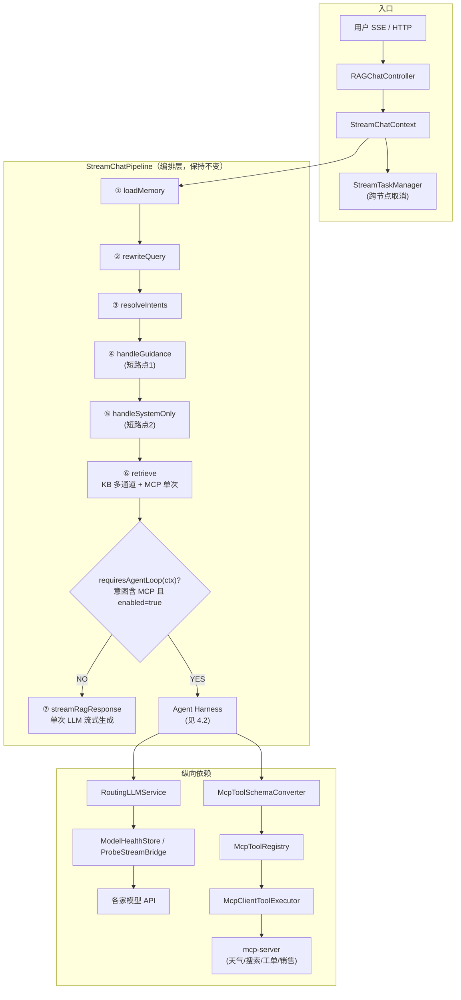
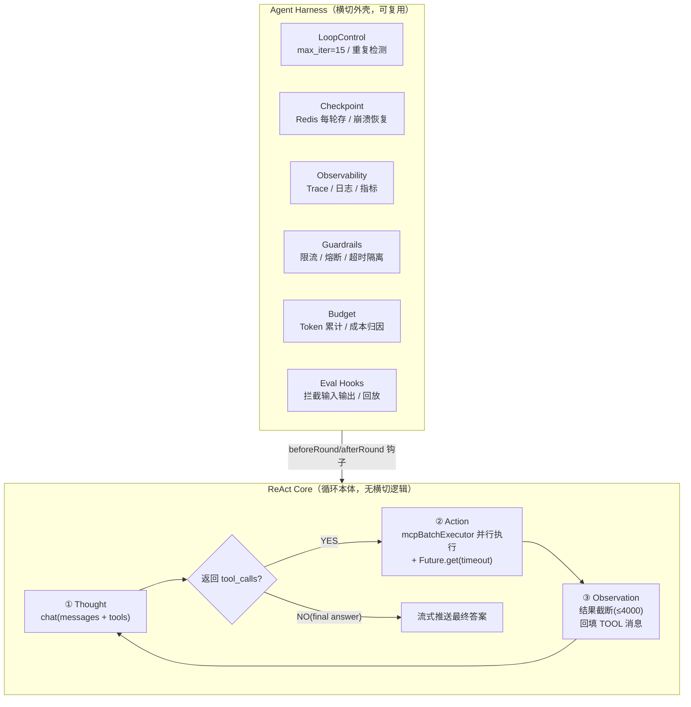
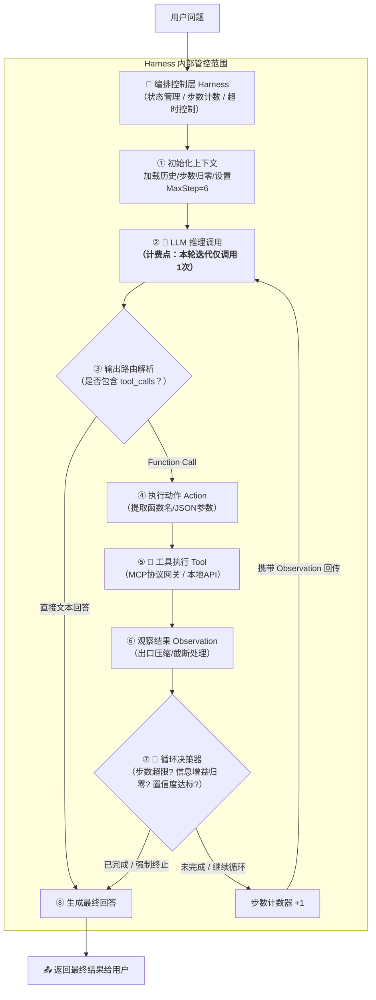
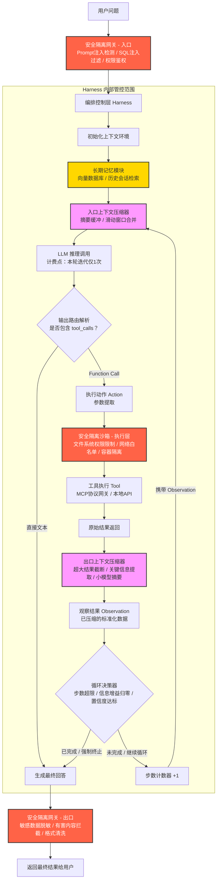
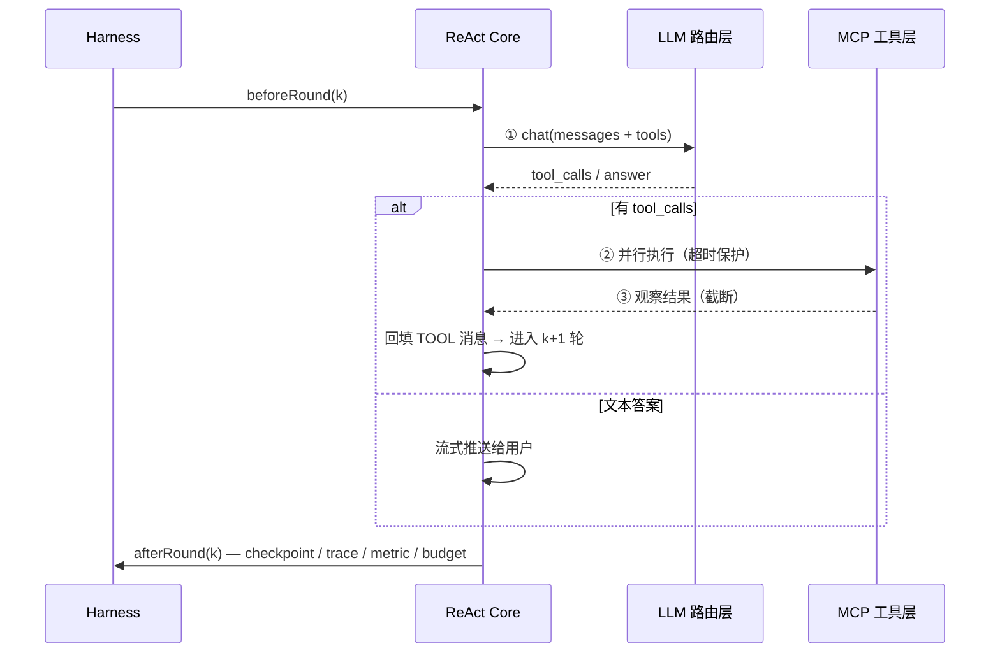

# ReAct + Harness 架构设计与能力缺口分析

> 目标：为 ragent 增加 **Agent ReAct 循环**（LLM 自主工具调用），并梳理当前项目已有的基础设施与尚欠缺的能力。
>
> 术语约定：本文的 **Harness** 指「Agent 执行外壳 / 运行时」——把裸 ReAct 循环包起来的那套生产级横切能力（循环控制、状态持久化、可观测、治理、预算、评测钩子）。"玩具 ReAct" 与 "可上线的 ReAct" 的核心差别就在 Harness。

---

## 一、结论先行

1. **不引入现成框架**（Spring AI / LangChain4j / Google ADK），基于现有 `infra-ai` 自研 ReAct 循环，仅参考 LangChain4j 的 `@Tool` 声明风格。
2. **定位为可选增强分支**：`StreamChatPipeline` 第 ⑥ 步之后，当意图包含 MCP 节点且 `rag.agent.function-calling.enabled=true` 时进入 Agent 循环；KB 检索、闲聊、歧义引导等确定性场景仍走意图树路由。
3. **单 Agent + 多工具**：一个循环内 LLM 可自主串行/并行调用多个 MCP 工具。
4. **工具层继续走 MCP**：复用 `McpToolRegistry` / `McpClientToolExecutor` 执行层，只新增「Schema 转换」和「tool_calls 决策解析」。

---

## 二、现状架构（简要）

```
用户 → RAGChatController(SSE) → StreamChatContext → StreamChatPipeline
                                          │
     ①loadMemory → ②rewriteQuery → ③resolveIntents → ④handleGuidance(短路)
                                          │
     ⑤handleSystemOnly(短路) → ⑥retrieve(KB 多通道 + MCP 单次) → ⑦streamRagResponse
```

当前"工具调用"是一条**非 Function Calling 路径**：工具选择由意图树叶子节点 `mcpToolId` 写死，参数由 `LLMMcpParameterExtractor` 额外调一次 LLM 提取，执行后结果拼进 Prompt 做单次 LLM 生成。**不是 LLM 自主决定调哪个工具，也没有多轮循环。**

---

## 三、能力缺口清单

按"决策层 / 循环本体 / Harness 外壳 / 工具执行层 / 工具发现"五层标注。状态说明：✅ 已有 · ⚠️ 部分具备 · ❌ 欠缺。

### 3.1 决策层（Function Calling）—— 全部欠缺 ❌（0%）

这是最核心的缺口：目前 LLM 从不自主决定"调哪个工具"。

| 能力 | 现状证据 | 缺什么 |
|---|---|---|
| `ChatMessage` 工具角色 | `Role` 只有 `SYSTEM/USER/ASSISTANT`（`framework/.../convention/ChatMessage.java:45`） | ❌ 无 `TOOL` 角色、无 `toolCallId` 字段，无法回填工具结果到消息序列 |
| `ChatRequest` 工具声明 | 只有预留的 `enableTools` 布尔，全项目无人读写（`ChatRequest.java:112-123`） | ❌ 无 `tools` 列表结构，无法把 MCP 工具 Schema 传给 LLM |
| 结构化返回 | `LLMService.chat()` 只返回 `String`（`infra-ai/.../LLMService.java:86`） | ❌ 拿不到 `tool_calls` 数组，只能拿文本 |
| `tool_calls` 解析 | `OpenAIStyleSseParser` 只解析 `content`/`reasoning_content`（`:55-57`） | ❌ 无 `tool_calls` delta 拼装 |
| Schema 转换 | `McpToolSchemaConverter` 不存在 | ❌ MCP JSON Schema → OpenAI `tools` 参数格式 |

**验证**：全项目 grep `tools / tool_calls / ToolCall / Role.TOOL` 零匹配。

### 3.2 ReAct Core 循环本体 —— 全部欠缺 ❌（0%）

| 能力 | 现状证据 | 缺什么 |
|---|---|---|
| 循环骨架 | `StreamChatPipeline` 是 7 步直线流水线，无 while | ❌ `AgentLoopExecutor`（Thought→Action→Observation 循环） |
| 多轮消息累积 | 单次 `streamChat`，无消息回填 | ❌ 工具结果 → 下轮 LLM 的闭环 |
| 自主终止 | 无 | ❌ LLM 输出文本即停、工具调用则继续的分支 |

### 3.3 Harness 外壳 —— 部分具备 ⚠️

| 能力 | 状态 | 证据 |
|---|---|---|
| 治理 · 限流 | ✅ | `FairDistributedRateLimiter` + `ChatQueueLimiter` |
| 治理 · 模型熔断降级 | ✅ | `ModelHealthStore` + `ProbeStreamBridge` |
| 可观测 · Trace | ⚠️ | `RagStreamTraceSupport` + `t_rag_trace_run/node` 已有，但**无 token / tool_calls 维度** |
| 循环控制（硬上限 / 重复检测） | ❌ | 全项目无 `max_llm_calls` / 连续重复调用检测 |
| Checkpoint 断点恢复 | ❌ | `rag/service` 目录 grep `checkpoint/restore/resume/断点` **零匹配**，实例挂 = 任务全丢 |
| Token 预算 / 成本归因 | ❌ | 有 `TokenCounterService`，但无累计预算、无按调用点成本归因 |
| 评测钩子 | ❌ | `EvalController` 只评检索/意图，无 `expectedToolCalls` |

### 3.4 工具执行层 —— 基本已有，缺两块 ⚠️

| 能力 | 状态 | 证据 |
|---|---|---|
| MCP 执行 / 注册 / 发现 | ✅ | `McpToolRegistry` + `McpClientToolExecutor` |
| 多工具并行 | ✅ | `RetrievalEngine.executeMcpTools()` + `mcpBatchExecutor`（`ThreadPoolExecutorConfig.java:47`） |
| 工具失败兜底 | ✅ | 异常 catch → `isError=true`（`RetrievalEngine.java:328-333`） |
| 单工具超时 | ❌ | 用 `CompletableFuture.join()`（`:341`），**无 `Future.get(timeout)`**，慢工具会无限阻塞线程 |
| 工具结果截断 | ❌ | 检索侧有截断（RRF/WebSearch），但 **MCP 工具返回值无 `maxToolOutputLength` 截断**，超长结果会撑爆上下文 |

### 3.5 工具发现 —— 已有两层，缺转换与筛选 ⚠️

**已有的两层发现：**

```
第 1 层 · 代码级发现（本地 Bean）
  DefaultMcpToolRegistry 注入 List<McpToolExecutor>，@PostConstruct 自动 register()
  （DefaultMcpToolRegistry.java:51,56-66）

第 2 层 · MCP 协议级发现（远端 tools/list）
  McpClientAutoConfiguration.init()
    ├─ 读配置 rag.mcp.servers（McpClientProperties）
    ├─ McpClient.sync(transport).initialize()  握手
    ├─ client.listTools()  ← MCP 协议 tools/list
    ├─ 每个 Tool 包成 McpClientToolExecutor
    └─ toolRegistry.register(executor)
  （McpClientAutoConfiguration.java:75-92）
```

发现到的 `Tool`（`io.modelcontextprotocol.spec.McpSchema.Tool`）已带齐 LLM 所需元数据：`name()`、`description()`、`inputSchema()`（含 `properties`/`required`）。`McpToolRegistry.listAllTools()` 随时可拿全量清单。

**尚缺的两件事：**

1. **Schema 转换**（`McpToolSchemaConverter`）：MCP `inputSchema` 已是 JSON Schema，OpenAI `tools[].function.parameters` 也是 JSON Schema → 95% 透传，只处理 `$ref` 内联、`oneOf/anyOf/allOf` 降级、剥离 `$schema`/`definitions`/`additionalProperties`。
2. **工具子集筛选**：见 §五 设计决策 B。

**隐藏坑**：`McpClientAutoConfiguration` 只在 `@PostConstruct` 跑一次 `listTools()`，之后 `McpToolRegistry` 是静态快照；未接 MCP `notifications/tools/list_changed` 运行期增删通知。

---

## 四、完善后的整体架构图

### 4.1 总览：ReAct 作为 Pipeline 的增强分支



### 4.2 核心：Agent Harness 外壳 + ReAct 循环本体




### 4.3 核心: reAct+herness 循环架构



### 4.3 核心: reAct+herness 最终版本




### 4.5 单轮时序



---

## 五、关键设计决策

| # | 决策 | 说明 |
|---|---|---|
| A | **Harness 与 Core 解耦** | 循环本体只做 `Thought→Action→Observation`，横切能力通过 `beforeRound/afterRound` 钩子注入。Core 可替换（未来换 PlanReAct/Reflexion），Harness 不动 |
| B | **工具白名单筛选（推荐）** | 用 `resolveIntents()` 命中的 MCP 叶子节点 `mcpToolId` 集合过滤工具，只喂相关工具给 LLM。保留意图树"范围收敛"优势，降低幻觉调用面、成本与风险 |
| C | **决策层与执行层分离** | LLM 只负责"决定调谁、传什么参"（Function Calling），MCP 负责"怎么调"（执行层已成熟），中间用 `McpToolSchemaConverter` 做契约转换 |
| D | **最大程度复用 infra** | 模型路由、断路器、首包降级、限流、取消链路全部沿用，自研只补「循环 + tool_calls 解析 + Schema 转换」三块 |
| E | **Phase 1 用非流式拿 tool_calls** | `chat()` 同步拿完整 `tool_calls` 最简单可靠（首轮可能 2~5s 无输出）；流式 `tool_calls` 解析作为可选增强 |

---

## 六、实施优先级

| 优先级 | 内容 | 状态 | 估算 |
|---|---|---|---|
| **P0** | `ChatMessage` 加 `TOOL` 角色 + `toolCallId` | ❌ 新增 | ~30 行 |
| **P0** | `ChatRequest` 加 `tools` 列表结构 | ❌ 新增 | ~40 行 |
| **P0** | `McpToolSchemaConverter`（Schema 转换） | ❌ 新增 | ~200 行 |
| **P0** | `LLMService` 结构化返回 + 客户端 `tools` 输出 / `tool_calls` 解析 | ❌ 新增 | ~120 行 |
| **P0** | `AgentLoopExecutor`（ReAct 循环 + 四层防御） | ❌ 新增 | ~300 行 |
| **P1** | `StreamChatPipeline` 分支接入 + 工具白名单筛选 | ❌ 新增 | ~50 行 |
| **P1** | 配置项 `rag.agent.*`（默认关闭） | ❌ 新增 | ~20 行 |
| **P1** | 单工具超时 + 工具结果截断 | ❌ 新增 | ~60 行 |
| **P1** | TDD 单元测试（Schema 转换 / tool_calls 解析 / 循环终止 / 超时） | ❌ 新增 | ~200 行 |
| **P2** | Redis checkpoint 断点恢复 | ❌ 新增 | ~150 行 |
| **P2** | Trace 扩展 token / tool_calls 维度 + 成本归因 | ⚠️ 扩展 | ~100 行 |
| **P2** | `EvalController` 加 `expectedToolCalls` 评测闭环 | ⚠️ 扩展 | ~100 行 |

> 缺口分布一句话总结：执行层 90% 已有（缺超时 + 截断），治理/可观测 60% 已有（缺 checkpoint + token 预算 + eval 钩子），**决策层与循环本体 0%**（需从零建）。真正要新写的核心代码约 600~900 行，其余全部复用现有基础设施。
